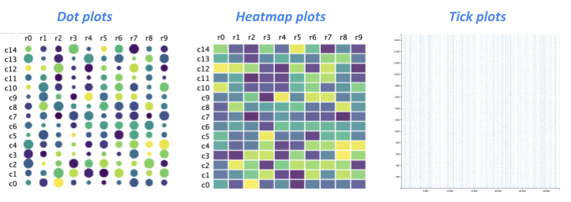

# epiviz.heatmap.gl

- API: [https://epiviz.github.io/epiviz.heatmap.gl/docs/](https://epiviz.github.io/epiviz.heatmap.gl/docs/)
- DEMO: [https://epiviz.github.io/epiviz.heatmap.gl/](https://epiviz.github.io/epiviz.heatmap.gl/)
- Examples are in the [app/index.html](./app/index.html) directory



A fast and scalable WebGL2 based rendering library for visualizing heatmaps/dot plots. The library uses [epiviz.gl](https://github.com/epiviz/epiviz.gl) under the hood and provides an easier interface for use in various applications.

Internally, the library creates two WebWorkers

- data worker: indexes the data points using [flatbush](https://github.com/mourner/flatbush)
- webgl worker: all the rendering magic happens here

`epiviz.gl` uses [OffScreenCanvas](https://developer.mozilla.org/en-US/docs/Web/API/OffscreenCanvas) to delegate rendering to a worker. since the main thread of the browser is less busy, this provides a fluid, high-performance user experience for applications.

## Getting started

### Installation

package is available through [npm](https://www.npmjs.com/package/epiviz.heatmap.gl)

```sh
  npm install epiviz.heatmap.gl
```

### Usage

- [app/index.html](./app/index.html) provides an easier example and code on how to use the library

#### Intensity Legend

Adding an Intensity Legend is optional. If you wish to add one, the simplest way is to provide the data in the following format:

```javascript
[
  { color: "#fff", intensity: 0.1, label: "-2" },
  { color: "#fff", intensity: 0.2, label: "-1.5" },
];
```

You can use the existing setState method to provide the legend Data encoding like so:

```javascript
plot.setState({
  legendIntensityData,
});
```

With this option, the intensity legend will render at the bottom of the graph by default. You can always change the position using the setIntensityLegendOptions method:

```javascript
setIntensityLegendOptions("top" | "bottom" | "left" | "right");
```

If you wish for the legend to be rendered somewhere else in the DOM, you must provide the selector or DOM element, along with the position/type of intensity legend you want, for example:

```javascript
setIntensityLegendOptions("top", ".intensity-legend");
```

You can also specify width and height:

```javascript
setIntensityLegendOptions("top", ".intensity-legend", 400, 500);
```

#### Customizing Labels with `setLabelOptions`

This method allows you to customize the label options for your visualization. All parameters are optional, providing you the flexibility to specify the options that best suit your needs.

**Parameters**:

- `labelOptions` (`object`): an object containing the label options
  - `labelOptions.rowLabelMaxCharacters` (`number`, optional): maximum number of characters to show for row labels
  - `labelOptions.columnLabelMaxCharacters` (`number`, optional): maximum number of characters to show for column labels
  - `labelOptions.rowLabelSlintAngle` (`number`, optional): slant angle for row labels (default: 0)
  - `labelOptions.columnLabelSlintAngle` (`number`, optional): slant angle for column labels (default: 0)
  - `labelOptions.rowLabelFontSize` (`string | number`, optional): font size for row labels (default: 7px)
  - `labelOptions.columnLabelFontSize` (`string | number`, optional): font size for column labels (default: 7px)

**Example**:

```javascript
plot.setLabelOptions({
  rowLabelMaxCharacters: 10,
  columnLabelMaxCharacters: 10,
  rowLabelSlintAngle: 45,
  columnLabelSlintAngle: 45,
  rowLabelFontSize: "10px",
  columnLabelFontSize: "10px",
});
```

#### Grouping Bars and Labels for Rows and Columns

This feature allows users to add grouping bars and labels to both rows and columns of the heatmap. It provides a convenient way to visually represent different groups in your heatmap data.

##### Usage

You can use this feature by providing `groupingRowData` and `groupingColumnData` in your heatmap configuration. Both of these properties accept an array of objects, where each object represents a group and has the following properties:

- `startIndex`: The start index of the group in the data.
- `endIndex`: The end index of the group in the data.
- `color`: The color of the group bar.
- `label`: The label of the group.

Here's an example of how you can define your group data:

```javascript
const groups = [
  {
    startIndex: 0,
    endIndex: 1,
    color: "#52bc9a",
    label: "group 1",
  },
  // Additional groups...
];
```

Once the data is constructed, pass it to the library using the setState function:

```javascript
plot.setState({
  groupingRowData,
  groupingColumnData,
});
```

By default, the grouping color legends will be added inside the main DOM element, and the graph and x,y labels will be auto adjusted. There will be no labels for groups. However, users can hover over the legends to see the group name on the tooltip. You can customize this behavior with the help of the `setRowGroupingLegendOptions` and `setColumnGroupingLegendOptions` methods.

```javascript
plot.setRowGroupingLegendOptions(
  "left",
  null,
  ".grouping-labels-rows",
  "vertical"
);
plot.setColumnGroupingLegendOptions(
  "top",
  ".grouping-color-bar",
  ".grouping-labels-columns"
);
```

The first argument represents the positioning. For rows, it can be either "left" or "right". For columns, it can be either "top" or "bottom". The second argument is a DOM element reference for grouping color bars in case you want it to be rendered somewhere else in the DOM. You can also pass null if you wish to keep the default behavior. The third argument is for grouping labels. As mentioned earlier, by default there will be no labels for groups. Group names will be visible via tooltip by default. If you wish to render them, you must provide the DOM element to render it to. The third argument represents the DOM element for it. The fourth argument represents the orientation of labels. If you want to place them vertically from top to bottom or horizontally. This is optional. By default for rows, it will be vertical, and for columns, it will be horizontal.

#### Customizing Row Group Legend with `setRowGroupingLegendOptions`

This method allows you to customize the row group legend in your heatmap. It offers various parameters for flexibility.

**Parameters**:

- `position` (`string`): Position of the legend, can be "left" or "right".
- `groupingColorBarDOM` (`string` or `null`): DOM element reference for grouping color bars, or `null` for default behavior.
- `groupingLabelDOM` (`string`): DOM element reference for grouping labels.
- `orientation` (`string`): Orientation of the legend, can be "horizontal" or "vertical".

**Example**:

```javascript
plot.setRowGroupingLegendOptions(
  "left",
  null,
  ".grouping-labels-rows",
  "vertical"
);
```

#### Customizing Column Group Legend with `setColumnGroupingLegendOptions`

This method allows you to customize the column group legend in your heatmap.

**Parameters**:

- `position` (`string`): Position of the legend, can be "top" or "bottom".
- `groupingColorBarDOM` (`string` or `null`): DOM element reference for grouping color bars, or `null` to keep the default behavior.
- `groupingLabelDOM` (`string`): DOM element reference for grouping labels.
- `orientation` (`string`, optional): Orientation of labels, either "horizontal" or "vertical". Default is "horizontal".

**Example**:

```javascript
plot.setColumnGroupingLegendOptions(
  "top",
  ".grouping-color-bar",
  ".grouping-labels-columns",
  "horizontal"
);
```

#### React Usage

To use the library in a React application

```javascript
import { ReactDotplot } from 'epiviz.heatmap.gl/react'

const Component = () => {
  let id = 'unique-id'
  let data = {
    x: [...],
    y: [...],
    xlabels: [],
    ylabels: [],
  }
  let color = [...] // color/rgb/hex code of each dot
  let size = [...] // size of each dot

  return <ReactDotplot
            id={id}
            data={data}
            color={color}
            size={size}
          >
}
```

### Types of Plots

The library provides three ways of rendering heatmap layout plots.

- `RectplotGL` - for traditional heatmaps
- `DotplotGL` - for making dot plot like plots, [reference](https://divingintogeneticsandgenomics.rbind.io/post/clustered-dotplot-for-single-cell-rnaseq/)
- `TickplotGL` - Tick plots are extremely fast at quickly rendering large amounts of data, helpful for rendering interactive [HiC like plots](https://www.bioinformatics.babraham.ac.uk/projects/seqmonk/Help/3%20Visualisation/3.2%20Figures%20and%20Graphs/3.2.12%20The%20HiC%20Heatmap%20Plot.html#:~:text=The%20HiC%20heatmap%20plot%20is,DataStore%20is%20a%20HiC%20dataset.).

The API is same for all these plots.

```js
import { DotplotGL, RectplotGL, TickplotGL } from "./index.js";

// you can either pass in a dom selector or HTMLElement
let plot = new DotplotGL(".canvas");

// provide input data to the element,
// data must contain x (as `rows`) and y (as `columns`)
// you can also provide x and y labels
plot.setInput({
  x: [...],
  y: [...],
  xlabels: [],
  ylabels: [],
});

// render the plot
plot.render();
```

### Advanced Usage

The library provides methods to capture events and modify attributes

#### Interaction modes

Supports three modes

- `pan` - no selection, pan (`drag`)/zoom (`wheel`) the canvas
- `box` - box selections, no pan but allows zoom (`wheel`)
- `lasso` - same as box, no pan but allows zoom (`wheel`)

```js
plot.setInteraction("pan");
```

#### Events

- hoverCallback
- clickCallback
- selectionCallback
- highlightedIndicesCallback

**_hover and click also provide the distance of the point from the mouse location. This metric can be used to enable various interactions._**

```js
plot.hoverCallback = function (point) {
  if (point) {
    //   use some threshold (1.5)
    if (point.distance <= 1.5) {
      console.log(`${point} is closest`);
    }
  }
};

plot.selectionCallback = function (points) {
  // ... do something ...
  console.log(points);
};

plot.highlightedIndicesCallback = function (indices) {
  // ... do something ...
  console.log(indices);
};
```

#### Encodings

These attributes either take a fixed value or an array of values for each data point.

- `color` - color/rgb/hex code
- `size` - size of each dot
- `opacity` - opacity across the entire plot
- `xgap` or `ygap` - gap between rows and columns
- `intensityLegendData` - an array of objects containing color, intensity, and label for the legend.
  e.g [{color: "#000000", intensity: 1, label: "0.1"}]

```js
  plot.setState({
    size: <SIZE>
    color: <COLOR>
    xgap: <GAPS>,
    ygap: <GAPS>,
    opacity: <OPACITY>
    intensityLegendData: <INTENSITY_LEGEND_DATA>
  });
```
